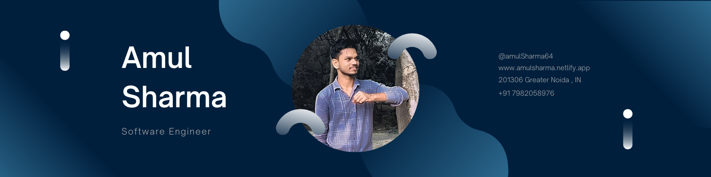

<!--    -->
# Hello World! 

This is Amul Sharma here and I am currently Pursuing MCA(Master of Comouter Application) at RBMI Group of Institutions, Greater Noida. I have completed my Bachelors of Computer Applications from RBMI Group of Institutions, Greater Noida. I have previous work experiences as a Full Stack Developer. My areas of expertise include Coding and computer programming, Software development,Software testing,and Object-oriented design (OOD). My hobbies are Travelling, Reading, and photography. 

- 👀 I’m interested in ...Web technology
- 🌱 I’m currently learning ...MongoDb And nodejs
- 👯 I’m looking to collaborate on ...Open source projects
- 🤔 I’m looking for help with ...Machine learnig
- 💬 Ask me about ...Anything
- 😄 Pronouns: ...He/Him
- ⚡ Fun fact: ..I am a workaholic :-P  

## 🚀 Skills

    

     
    

## ⚙ Statistics and Languages 
     

## 📫 How to reach me:

  

## ❤ Views and Followers

<!---
Amulsharma64/Amulsharma64 is a ✨ special ✨ repository because its `README.md` (this file) appears on your GitHub profile.
You can click the Preview link to take a look at your changes.
--->
